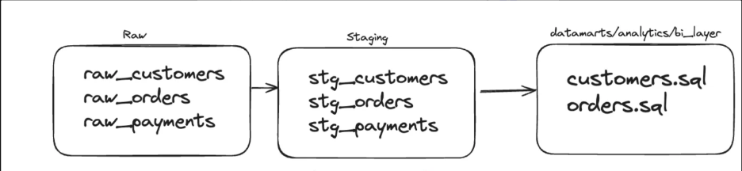
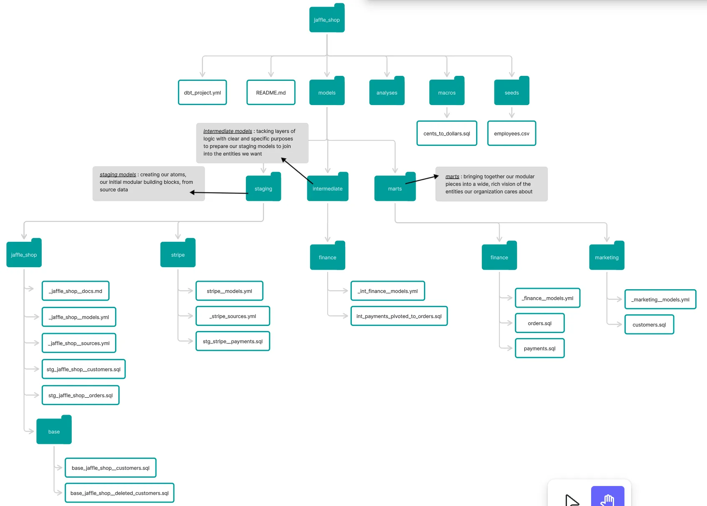
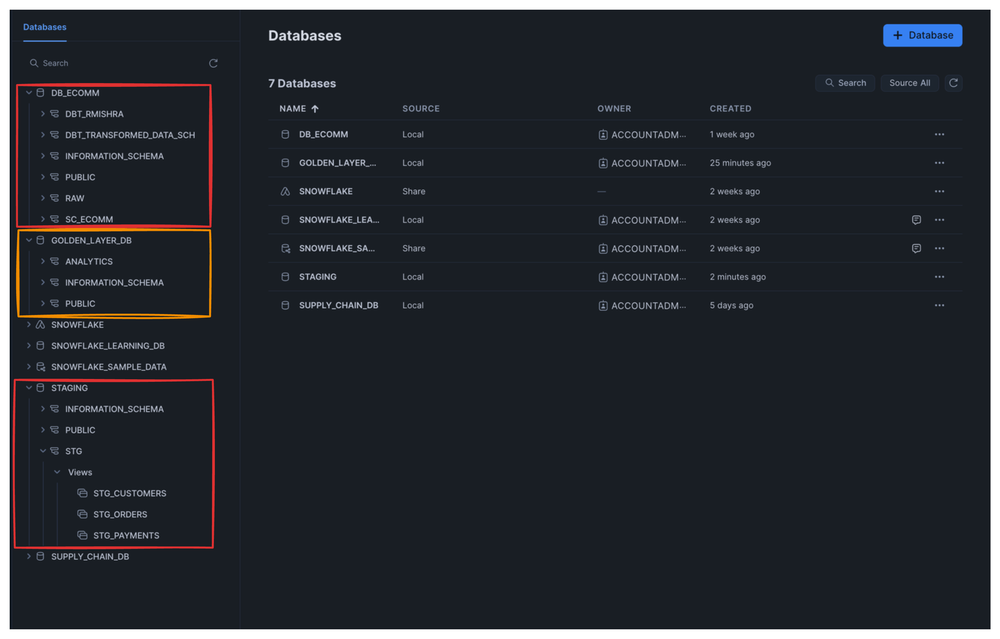

# 🧱 dbt Snowflake Project – Raw to Golden Layer Pipeline

An end-to-end **dbt project** demonstrating how to transform raw data into clean, analytics-ready data models inside **Snowflake** using a layered architecture — **Raw → Staging → Data Marts (Golden Layer)**.

This project simulates an e-commerce use case to showcase data cleaning, transformation, modeling, and documentation using `dbt`.

---

## 🚀 Project Overview

The goal of this project is to help an e-commerce company prepare clean, transformed, and structured data using an industry-standard pipeline inside Snowflake.

### 🧩 Key Objectives

- Extract raw data from source systems (Snowflake tables)
- Apply data cleaning and minimal transformations in the **staging layer**
- Build meaningful, analytics-ready **data marts** in the **golden layer**
- Split environments into different databases for modular access
- Leverage `dbt` documentation, macros, tests, snapshots, and lineage graphs

---

## 📁 Project Folder Structure

```bash
.
├── analyses/
├── macros/
├── models/
│   ├── raw/
│   ├── staging/
│   └── marts/
├── seeds/
├── snapshots/
├── tests/
├── dbt_project.yml
├── README.md
└── .gitignore
```

---

## 🧠 Use Case

To showcase the workflow, we used a simplified **customer payments use case**.

📌 **Requirement:** Create a customer summary table with:

- Customer name
- Total payments
- First order date
- Most recent order date

We used the `RA_CUSTOMERS`, `RAW_ORDERS`, and `RAW_PAYMENTS` tables in the **RAW** layer → cleaned them in **STAGING** → built a **customer_payments_summary** model in the **DATA MART** layer using modular SQL and **CTEs** for transparency.

---

## 🛠️ Data Layer Architecture

We followed a **3-layer dbt modeling approach**, commonly used in modern data teams to promote modularity and maintainability:

1. **Raw Layer** – Mirrors source data as-is from Snowflake
2. **Staging Layer** – Applies lightweight cleaning and renaming
3. **Data Marts (BI Layer)** – Contains business logic, aggregations, and is exposed to analysts

📌 Here's how the data flows through each layer in our project:



---

### 🔹 Raw Layer

- `raw_customers`, `raw_orders`, `raw_payments`
- Defined via source blocks from Snowflake
- No transformations here — raw copy from source

### 🔸 Staging Layer

- `stg_customers`, `stg_orders`, `stg_payments`
- Renames columns, applies formatting
- No joins or business logic — just cleanup

### 🟢 Data Mart / Analytics Layer

- `customers.sql`, `orders.sql`
- Uses CTEs and joins to generate summary tables
- Deployed to a separate Snowflake DB: `GOLDEN_LAYER_DB`

📦 All models in the **marts layer** are configured to write into a separate Snowflake DB: `GOLDEN_LAYER_DB.ANALYTICS`

```sql
{{ config(
    database='GOLDEN_LAYER_DB',
    schema='ANALYTICS'
) }}
```

## 🧭 Inspiration from Jaffle Shop

Our dbt project structure was inspired by the well-known `jaffle_shop` architecture — a community standard that showcases modular, scalable dbt practices.

📌 This approach promotes:

- Separation of concerns (raw → staging → intermediate → marts)
- Clean folder structure with scoped models
- Reusability and clarity through modular SQL logic
- Purpose-driven naming and yml metadata

We adapted this model to our own use case with simplified **raw → staging → marts** layers for an e-commerce business case.

Here’s a visual of the original `jaffle_shop` architecture that guided our planning:



## 🏗️ Snowflake Database Structure

To follow industry best practices, we separated each dbt layer into its own **Snowflake database**:

- `DB_ECOMM` for RAW source data
- `STAGING` for staging models (cleaned, renamed columns)
- `GOLDEN_LAYER_DB` for final **data mart** models used by BI teams

This structure improves:

- Access control between teams
- Performance tuning per layer
- Clarity in model lineage and ownership

📸 Here’s a visual snapshot of how the layers were structured in Snowflake:



## 📊 DAG & Lineage Graph

Here’s a glimpse of our dbt **model DAG** showing the data flow from the raw layer to staging models and finally to the customer-level data mart:

### 📌 Model DAG


---

### 📌 Lineage Graph


You can also explore the complete interactive documentation and lineage via dbt Cloud:

👉 [View dbt Docs](https://ly421.us1.dbt.com/accounts/70471823470455/develop/70471823938707/docs/index.html#!/overview/my_new_project)

> ⚠️ **Note:** This link points to my personal dbt Cloud project. If my account becomes inactive or expires, the documentation may no longer be accessible.

---

## 📚 What I Learned

- How to structure a real-world dbt project
- Layered modeling: keeping raw, staging, and marts clean and modular
- Using dbt configs to split models across Snowflake databases
- Writing modular SQL with CTEs for debuggability
- Generating automated documentation and lineage graphs
- Industry-standard dbt project setup with folders for tests, snapshots, macros, seeds, and analysis

---

## 🌟 Why dbt?

> dbt (data build tool) enables data analysts and engineers to transform data in their warehouse more effectively by combining the power of SQL with modern software engineering best practices.

✅ Modular SQL  
✅ Version control with Git  
✅ Auto-documentation  
✅ Testing and CI support  
✅ Easy deployment and scaling  
✅ Compatible with Snowflake, BigQuery, Redshift, and others

---

## 🧩 Tech Stack

- **Snowflake** – Data warehouse
- **dbt** – Transformation and modeling
- **SQL** – Transformations and logic
- **GitHub** – Version control and collaboration

---

## 🧪 Next Steps

- Add more complex joins, time-based aggregations
- Integrate dbt Cloud for scheduled runs and CI/CD
- Add `schema.yml` for tests and descriptions
- Build BI dashboards on top of the Golden Layer

---

## 📎 Screenshots (Add Links Here)

- 📸 Snowflake Schema
- 📸 Staging Transformation Code
- 📸 Customer Summary Output Table
- 📸 DAG Lineage Graph

---

## 📫 Let's Connect

If you liked the project or have feedback, feel free to reach out via GitHub or LinkedIn!
